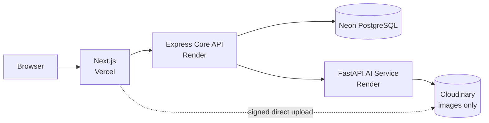
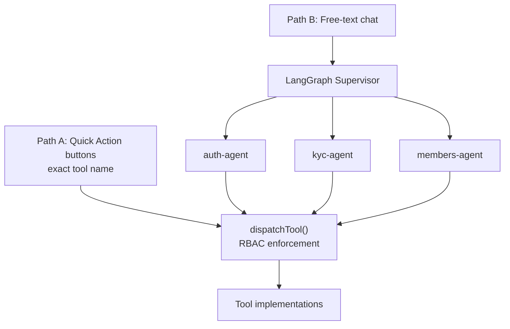

# VeriKYC: Agentic AI Identity Verification Platform

> AI does the heavy lifting. A human makes the final call. **No application is ever auto-approved.**

VeriKYC is a full-stack digital KYC platform that verifies government-issued identity documents (Aadhaar, PAN, Passport, Driving Licence) with an AI pipeline, then routes every application to a human reviewer. On top of the platform sits an **agentic chat layer**: a LangGraph supervisor with three specialist sub-agents, exposed through real **Model Context Protocol (MCP)** servers, where every action (button click or LLM tool call) passes through one RBAC enforcement point.

**Live demo:** https://verify-kyc-git-main-monishapatnana6-5579s-projects.vercel.app/login

---

## Highlights

- **Human-in-the-loop by design.** Every application lands in `PENDING_REVIEW`, whatever the AI score. Scores are hints for reviewers, never decisions.
- **Multi-agent system.** LangGraph supervisor plus three domain sub-agents (auth, KYC, members), each running its own ReAct tool-calling loop on Claude, with a Gemini fallback.
- **Real MCP servers.** Three MCP endpoints built on `@modelcontextprotocol/sdk` using `StreamableHTTPServerTransport` (stateless, one transport per request).
- **One enforcement point.** `dispatchTool()` applies RBAC to every tool call. The LLM cannot bypass role checks, and session fields (`userId`, `role`) are always overwritten server-side.
- **Multi-stage verification pipeline.** Liveness, quality gate, OCR, authenticity, fraud detection and face match, with document-specific validation (Verhoeff, MRZ check digits, PAN regex).
- **Security-first.** Rotating refresh tokens with reuse detection, hashed token storage, append-only audit log, direct-to-Cloudinary uploads, Redis-backed rate limiting.

---

## Tech Stack

| Layer | Technology |
|---|---|
| Frontend | Next.js 14, Tailwind CSS |
| Core API | Node.js, Express, TypeScript, Prisma ORM |
| AI Service | Python, FastAPI |
| Database | PostgreSQL on Neon |
| Storage | Cloudinary (signed direct upload) |
| Auth | JWT (15 min) + rotating refresh tokens (7 d) |
| Email | Brevo Transactional Email API |
| Agent Orchestration | LangGraph + Claude `claude-sonnet-4-6` (primary), Google Gemini `gemini-2.5-flash` (fallback) |
| Agent Protocol | Model Context Protocol (`@modelcontextprotocol/sdk`) |
| Rate Limiting | `express-rate-limit` backed by Upstash Redis |
| Deployment | Vercel (frontend), Render (core + AI service), Neon (DB) |

---

## Architecture



Images go straight from the browser to Cloudinary. No image bytes pass through the core API.

---

## Agentic AI Layer

The Agent Chat feature is a hybrid interface with two entry paths that converge on the same guarded executor.



- **Path A (Quick Actions):** a persistent button panel grouped by agent domain. Clicks send an exact tool name straight to the orchestrator and skip the LLM entirely (deterministic, zero token cost).
- **Path B (Free-text):** natural-language messages go through the LangGraph supervisor to one of three specialists. Each sub-agent runs its own ReAct loop. If `ANTHROPIC_API_KEY` is not set, the system falls back to a Gemini single-loop agent.

### Agent Domains

| Domain | Agent | Tools | Access |
|---|---|---|---|
| Authentication | `auth-agent` | Register, login, verify email, password management, profile | All roles |
| KYC | `kyc-agent` | Create application, upload documents, submit, check status | `APPLICANT` |
| Members | `members-agent` | Review queue, evidence bundle, claim, decision, audit trail | `REVIEWER`, `ADMIN` |
| Members (admin) | `members-agent` | User management | `ADMIN` only |

### MCP Endpoints

```
POST /api/v1/mcp/auth
POST /api/v1/mcp/kyc
POST /api/v1/mcp/members
```

Any MCP-compatible client can connect to these endpoints. RBAC still applies.

---

## KYC Flow

1. Applicant registers and verifies email (OTP via Brevo).
2. Applicant completes a **liveness check** (camera challenge, anti-replay via `LivenessSession`).
3. Applicant uploads a government ID (Aadhaar / PAN / Passport / Driving Licence) and a selfie.
4. The AI pipeline runs: **quality gate → OCR → authenticity → fraud detection → face match**.
5. The application routes to `PENDING_REVIEW` regardless of AI score.
6. A human reviewer claims it, inspects the evidence bundle, then **approves, rejects, or escalates**.
7. The applicant receives the decision with reason codes.

### Document Validation

| Document | Validation |
|---|---|
| Aadhaar | Verhoeff checksum on the 12-digit UID |
| PAN | Regex `^[A-Z]{3}[ABCFGHLJPTK][A-Z]\d{4}[A-Z]$` |
| Passport | ICAO 9303 MRZ check digits (7-3-1 weighting) |
| Driving Licence | QR, EXIF, and template layout checks |

### Scoring

```
doc_confidence = 0.40×auth + 0.35×(100−fraud) + 0.15×fields + 0.10×ocr
identity_score = 0.25×name + 0.20×dob + 0.05×gender + 0.15×address + 0.35×face
overall_score  = 0.55×mean(doc_confidence) + 0.45×identity_score
```

Score bands are **hints for reviewers only**. Nothing auto-approves.

---

## Security

- Refresh tokens are stored as a SHA-256 hash only, never the raw value.
- Refresh token **family revocation on reuse detection**: all sessions in the family are invalidated.
- Audit log is **append-only**: no `UPDATE` or `DELETE` on `AuditEvent`, ever.
- RBAC is enforced at `dispatchTool()` for both button clicks and LLM tool calls.
- Auto-injected session fields (`userId`, `role`) always overwrite LLM-supplied values, which blocks prompt-injection privilege escalation.
- Rate limits on all auth endpoints (Upstash Redis-backed in production).
- Direct-to-Cloudinary signed uploads keep image bytes off the core API.

---

## Project Structure

```
core/src/
  agent/
    agents.ts             # Auth + KYC + Members tool implementations and definitions
    prompts.ts            # LLM system prompt templates
    supervisor.ts         # LangGraph supervisor graph + Gemini fallback
    tools.ts              # 30 LangChain tool wrappers
    reasoning.service.ts  # Entry point: routes Path A (tool) and Path B (LLM)
  mcp/                    # auth.mcp.ts, kyc.mcp.ts, members.mcp.ts
  modules/
    auth/                 # Controller, router, service, schema, OTP
    applications/         # Controller, router, service
    documents/            # Controller, router, schema, service
    review/               # Controller, schema, service
    verification/         # AI pipeline: OCR, scoring, face match, fraud detection
  routes/                 # agent, audit, document, review routes
  services/token.service.ts  # JWT sign/verify + password reset tokens
  middleware/             # requireAuth, requireRole, errorHandler
  utils/                  # Prisma client, audit helpers
  rbac.ts                 # RBAC + dispatchTool(): enforcement for all tool calls
  index.ts                # Express entry point

frontend/src/
  app/                    # Next.js App Router pages (auth, protected, admin)
  components/             # chat/, liveness/, layout/, ui/
  hooks/                  # useCamera, useFaceDetection, useLivenessStateMachine
  lib/                    # api, types, upload, utils, liveness utilities
  context/                # AuthContext, ApplicationContext

ai-service/
  app/routers/            # FastAPI routers (face match, document OCR, liveness, ...)
```

---

## Local Setup

### Prerequisites

- Node.js 18+
- Python 3.10+
- A Neon (or any PostgreSQL) database
- A Cloudinary account
- A Brevo account (transactional email)
- An Anthropic API key (primary agent LLM) and/or a Google Gemini API key (fallback)
- Optional: Upstash Redis (rate limiting in production)

### 1. Configure environment

```bash
cp core/.env.example core/.env
cp frontend/.env.local.example frontend/.env.local
cp ai-service/.env.example ai-service/.env
# Fill in real values in each file
```

### 2. Install dependencies

```bash
# Core API
cd core && npm install

# Frontend
cd ../frontend && npm install

# AI service
cd ../ai-service
python -m venv .venv
source .venv/bin/activate        # Windows: .venv\Scripts\activate
pip install -r requirements.txt
```

### 3. Migrate and seed the database

```bash
cd core
npx prisma migrate deploy
npx prisma db seed
```

### 4. Start all services

```bash
# Terminal 1: Core API (port 4000)
cd core && npm run dev

# Terminal 2: Frontend (port 3000)
cd frontend && npm run dev

# Terminal 3: AI service (port 8000)
cd ai-service && source .venv/bin/activate
uvicorn app.main:app --reload --port 8000
```

Open http://localhost:3000.

### Test Accounts (after seeding)

| Role | Email | Password |
|---|---|---|
| Applicant | applicant@verikyc.dev | Test@1234 |
| Reviewer | reviewer@verikyc.dev | Test@1234 |
| Admin | admin@verikyc.dev | Test@1234 |

---

## Deployment

| Service | Platform | Notes |
|---|---|---|
| Frontend | Vercel | Set `NEXT_PUBLIC_API_URL` |
| Core API | Render | Set all `core/.env` vars in the dashboard |
| AI Service | Render (Docker) | Set `INTERNAL_TOKEN` to match core |
| Database | Neon | Use pooled `DATABASE_URL` plus `DIRECT_URL` for migrations |

---

## License

Copyright (c) 2026 Monisha Patnana

